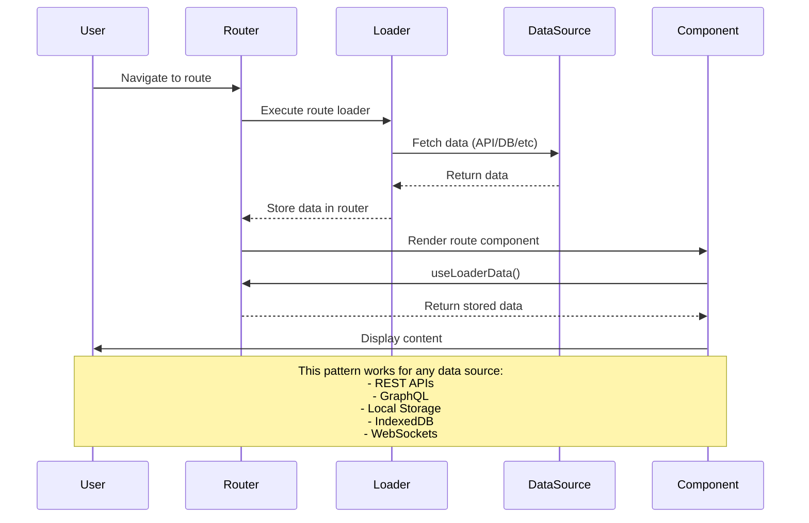
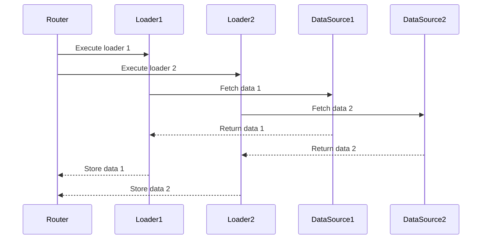

# React Router v6 Data Loading Pattern

## The Core Concept

React Router v6 introduces a new pattern for data loading that moves data fetching from components to the router level. This is a fundamental shift in how we handle data in React applications.

## How It Works

1. **Route Definition**

```javascript
const router = createBrowserRouter([
  {
    path: "/some-route",
    element: <SomeComponent />,
    loader: async () => {
      // Fetch any data you need
      const data = await fetchData();
      return data;
    },
  },
]);
```

2. **Component Usage**

```javascript
function SomeComponent() {
  // Access the data that was loaded
  const data = useLoaderData();
  return <div>{/* Use the data */}</div>;
}
```

## Key Features

### 1. Parallel Data Loading



### 2. Error Handling

```javascript
{
  path: "/some-route",
  element: <SomeComponent />,
  loader: async () => {
    try {
      const data = await fetchData();
      return data;
    } catch (error) {
      // Router will automatically show error boundary
      throw new Error("Failed to load data");
    }
  },
  errorElement: <ErrorComponent />
}
```

### 3. Loading States

```javascript
function Layout() {
  const navigation = useNavigation();
  const isLoading = navigation.state === "loading";

  return (
    <div>
      {isLoading && <LoadingSpinner />}
      <Outlet />
    </div>
  );
}
```

## Benefits Over Traditional Approach

1. **Performance**

   - Data loading starts before component rendering
   - Parallel data fetching
   - Automatic caching

2. **Developer Experience**

   - Less boilerplate code
   - Centralized data loading logic
   - Built-in TypeScript support

3. **User Experience**
   - Faster initial renders
   - Automatic loading states
   - Better error handling
   - Smoother navigation

## Common Use Cases

1. **Data Fetching**

   - API calls
   - Database queries
   - File system operations

2. **Authentication**

   - Session validation
   - Permission checks
   - User data loading

3. **Form Handling**

   - Form submission
   - Validation
   - Success/error states

4. **Real-time Updates**
   - WebSocket connections
   - Server-sent events
   - Polling
